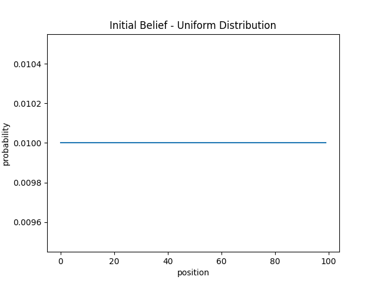
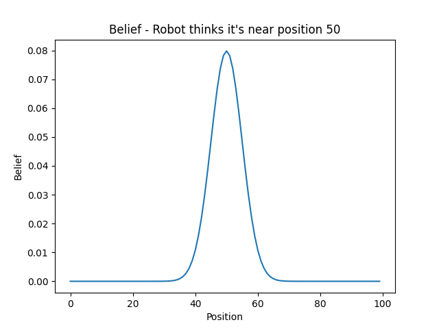
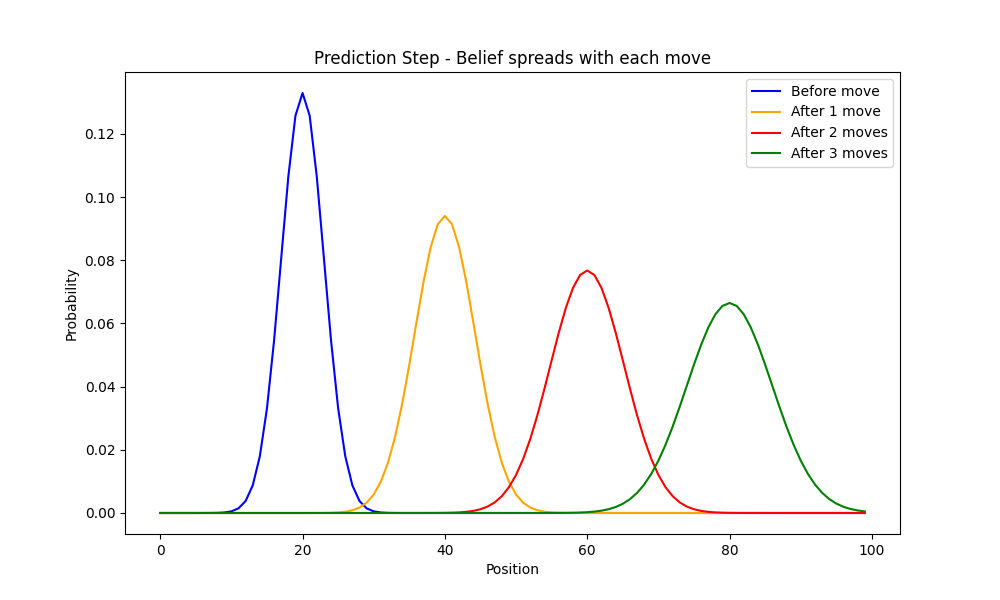
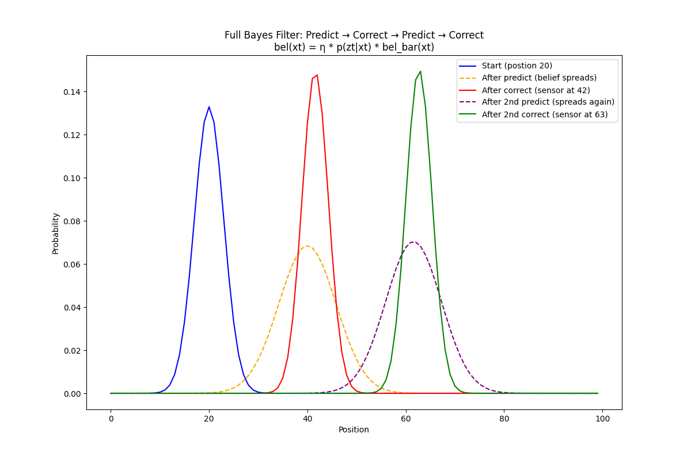
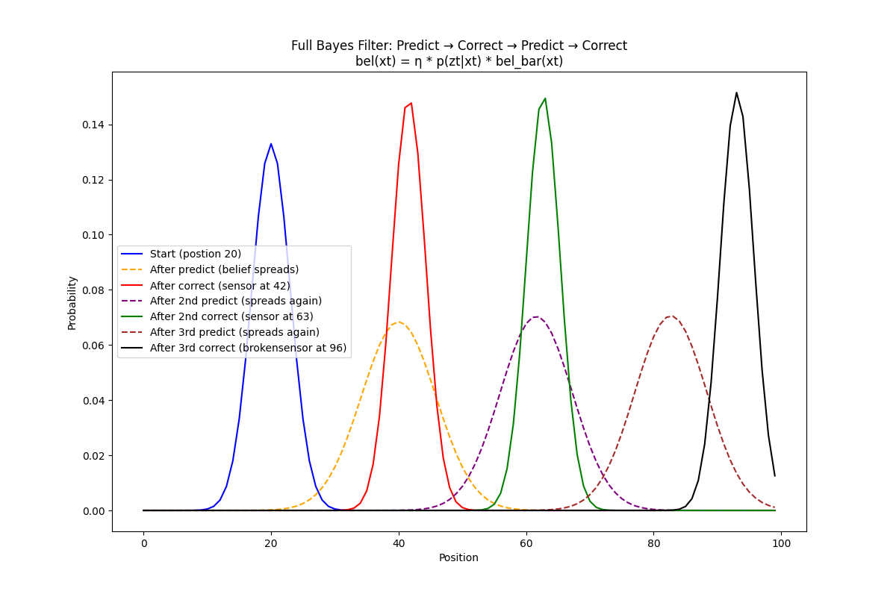
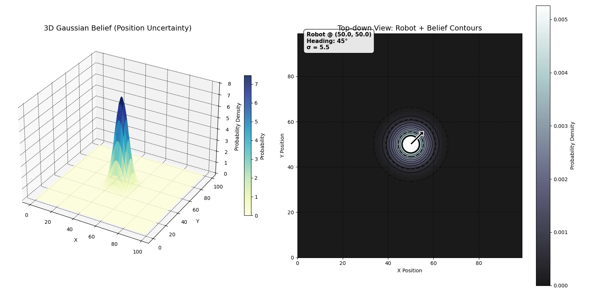
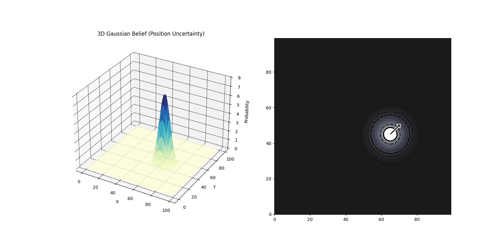
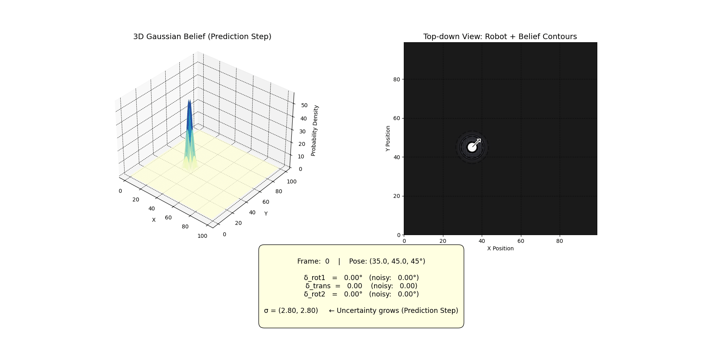

# My Journey to SLAM Engineer

This repository documents my journey to becoming a SLAM (Simultaneous Localization and Mapping) engineer, covering fundamental concepts to practical implementations.

## About

This project is developed with support from the [Hardware Innovation Community Buea](https://hwivc.org)

### Goal
My goal is to completely separate myself from the mindset of a researcher to an engineer. I want to get this into the real world and make a change. I will not spend time cramming formulas or proving the math. I will go directly into implementation and hopefully physical projects.

### Author
- LinkedIn: [Tambu Precious](https://www.linkedin.com/in/tambu-precious-29bb67217)

## Learning Resources

### Course 1: SLAM Course by Cyrill Stachniss (2013)
- **Link:** <http://ais.informatik.uni-freiburg.de/teaching/ws13/mapping/>
- **Description:** Foundational course covering core SLAM concepts and algorithms
- **Video:** [Watch the video](https://youtu.be/5Pu558YtjYM?si=HSbcel8BQt7dajBO)

## Code

- [1_state_estimation_basics1.py](1_state_estimation_basics1.py)
  - Start with a uniform belief in a 1D world.
  - The world contains a set of 100 points with equal probability 1/100 for each point.
  - What does it mean? It means the robot does not know where it is yet.
  - Why? It considers every point to have equal chances of the robot being there.
  - Image:  

- [1_state_estimation_basics2.py](1_state_estimation_basics2.py)
  - Somewhere around the 50.
  - So unlike the previous example, this code assumes the robot is around the mean but not completely certain about it. It forms a bell curve around the mean.
  - Why? You can never be so sure; actuator readings are never 100%. This is modeled by sigma.
  - Sigma signifies how far each reading is from the mean (50).
  - Image:  

- [2_motion_model_prediction_step1.py](2_motion_model_prediction_step1.py)
  - Move the robot while reading motor encoders, for example.
  - When moving a robot forward, the location xt-1 increments to xt after command ut is sent.
  - During this change, there can be mistakes. These mistakes are modeled by the bell curve.
  - That is why, rather than being absolute about being at xt, sigma says it is around xt.

  ### Some Math
  - `bel(xt) = ∫ p(xt | ut, xt-1) * bel(xt-1) dxt-1`
     [motion model] [previous belief]

  - This is known as the motion model. It predicts where the robot should be after a command u is applied (from a remote or autonomous manager).
  - Also notice that the height of each curve reduces over time. This is because after each step, the robot becomes less sure of where it is.
  - By the math: since the total probability must be 1, as each step is taken the curve widens so the amplitude drops to compensate and make the sum 1.
  - Image: 

- [3_observation_model_correction_step.py](3_observation_model_correction_step.py)
  - Predict and then correct the prediction using sensor reading.
  - Why? As we take each new step, the robot becomes more uncertain and its belief widens. A correction brings back certainty.
  - Image: 

  Summary:
  - PREDICT step:
    - `bel_bar(xt) = ∫ p(xt | ut, xt-1) * bel(xt-1) dxt-1`
    - [what motion says] [what we knew before]
    - belief SPREADS (less certain)

  - CORRECT step:
    - `bel(xt) = η * p(zt | xt) * bel_bar(xt)`
       [what sensor says] [what motion gave us]
    - belief SHARPENS (more certain)

  - So the correction is literally just multiplying the two together:
    - prediction × sensor reading = corrected belief
    - (where we think we are) × (where we seem to be) = (best estimate of where we are)

  - Neither one alone is enough:
    - Prediction only → uncertainty grows forever
    - Sensor only → too noisy, no memory
    - Combined → best of both worlds ✓
  - η makes sure total probability is 1.
  - If the sensor reading is bad, the correction may be far from what is real.
  - Image: 

- [4_odometry_motion_model2.py](4_odometry_motion_model2.py) && [4_odometry_motion_model2Animated.py](4_odometry_motion_model2Animated.py)

   - Before we begin with the odometry model, we need to find a way to represent the robot in 2D on a plane and the gaussian in 3D. 
   - Below shows that. The countours around the robot is also how gaussian is represented in 2D.

   - Image: 
     
     <small>*remember this is just like the [1_state_estimation_basics2.py](1_state_estimation_basics2.py) above but in 2D*<small>

- [5_odometry_motion_model_prediction_step_only.py](5_odometry_motion_model_prediction_step2D.py)

  - This script continues the prediction step in 2D using the odometry motion model.
  - It is similar to [2_motion_model_prediction_step1.py](2_motion_model_prediction_step1.py), but now the pose is (x, y, θ) instead of a single x position.
  - The relative motion command is computed as `u = (δ_rot1, δ_trans, δ_rot2)` from odometry readings.
  - These components are derived by comparing the previous pose `(x̄, ȳ, θ̄)` with the current odometry pose:
    - `δ_rot1` = initial rotation to point toward the next position
    - `δ_trans` = translation distance traveled
    - `δ_rot2` = final rotation to the new heading
  - The probabilistic motion model `p(x' | u, x)` adds Gaussian noise to each component using their variances.
  - The noisy motion is applied to the previous pose `(x, y, θ)` with trigonometry to compute the new pose.
  - Repeating this sampling generates a distribution over the next pose and captures motion uncertainty.
  - 
  - Result: 

  - As the robot moves, the Gaussian belief spreads and the curve amplitude decreases.
  - This is the same uncertainty effect seen earlier in 1D, and it is what the later correction step is designed to fix.

      
